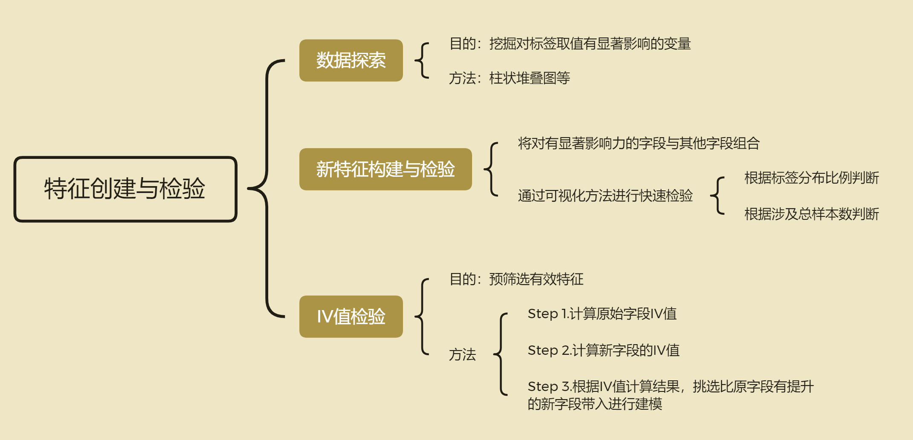

# 一.基于数据分布规律进行特征衍生

## 1.基于WOE-IV检验的一般特征衍生思路

### 1.1 整体思路设计图



### 1.2 IV值原理

&emsp;&emsp;当然，新建立的字段是否会对建模有帮助，最直接的方法就是分别带入进行建模，然后观察最终模型输出结果。但是，如果出于某些情况的考虑（如备选特征过多需要提前筛选、或者单次运行模型时间较长等），我们需要在不带入建模的情况下比较两个变量对模型提升效果优劣的话，也是有方法的，其中最通用同时也是被广泛验证较为有效的检验一个变量预测能力的方式，就是计算IV(information value)值，此处IV值和决策树的IV值同名，但这里的IV并不是依据C4.5中信息熵计算得来，而是一种简单基于样本比例的计算过程，其基本公式如下：

$$IV = \sum^{N}_{i=1}IV_i=\sum^{N}_{i=1}(P_{good}^{(i)}-P_{Bad}^{(i)})*WOE_i=
\sum^{N}_{i=1}(P_{good}^{(i)}-P_{Bad}^{(i)})*ln\frac{P_{Good}^{(i)}}{P_{Bad}^{(i)}}$$

首先，IV值的计算结果是二分类问题中某离散变量的信息价值，或者说该变量对标签取值的影响程度，IV值越大说明该字段对标签取值影响越大、带入该字段能够更有效的帮助模型进行预测。而在上述计算过程中，good/bad只是标签的不同取值，就相当于是1类样本和0类样本，而$i$则表示某特征的不同取值，$P_{Good}$和$P_{Bad}$则是在对应特征某取值下分组汇总后算得出来的1类样本和0类样本占所有1类/0类样本的比例，每个特征的不同取值都可以算得一组$IV_i$，而最终将一个特征内的所有$IV_i$进行求和，即可算出该特征的IV值。

**封装IV检测函数：**

```python
def IV(new_features, DataFrame=tcc, target=target):
    count_result = DataFrame[target].value_counts().values
    
    def IV_cal(features_name, target, df_temp):
        IV_l = []
        for i in features_name:
            IV_temp_l = []
            for values in df_temp[i].unique():
                data_temp = df_temp[df_temp[i] == values][target]
                PB, PG = data_temp.value_counts().values / count_result
                IV_temp = (PG-PB) * np.log(PG/PB)
                IV_temp_l.append(IV_temp)
            IV_l.append(np.array(IV_temp_l).sum())
        return(IV_l)
            
    if type(new_features) == np.ndarray:
        features_name = ['new_features']
        new_features = pd.Series(new_features, name=features_name[0])
    elif type(new_features) == pd.Series:
        features_name = [new_features.name]
    else:
        features_name = new_features.columns

    df_temp = pd.concat([new_features, DataFrame], axis=1)
    df_temp = df_temp.loc[:, ~df_temp.columns.duplicated()]
    IV_l = IV_cal(features_name=features_name, target=target, df_temp=df_temp)

    res = pd.DataFrame(IV_l, columns=['IV'], index=features_name)
    return(res)
```

### 1.3 评估

一般来说，IV值越大表示特征越有效，并且一般认为IV值和特征效果有如下对应关系：

| IV值         | 特征效果           |
| ------------ | ------------------ |
| <0.03        | 无效特征           |
| [0.03, 0.09) | 具有较弱判别效果   |
| [0.1, 0.29)  | 具有一定的判别效果 |
| [0.3, 0.49)  | 具有较好的判别效果 |
| >=0.5        | 具有极强的判别效果 |

但是，需要注意的是，新字段和数据原始特征都能计算IV值，而新字段又是由原始字段生成的，因此在信息量上会和原始字段有些重叠，若是需要通过IV值来判断新字段是否有用，则不能简单看新字段的IV值，而是需要用新字段的IV值和原始字段进行对比，新字段IV值至少要比原始字段IV最小值要大，新字段才是有效字段。

除了能够作为特征重要性评估手段外，IV值和WOE计算过程也经常用于连续字段分箱中，尤其常见于评分卡模型。